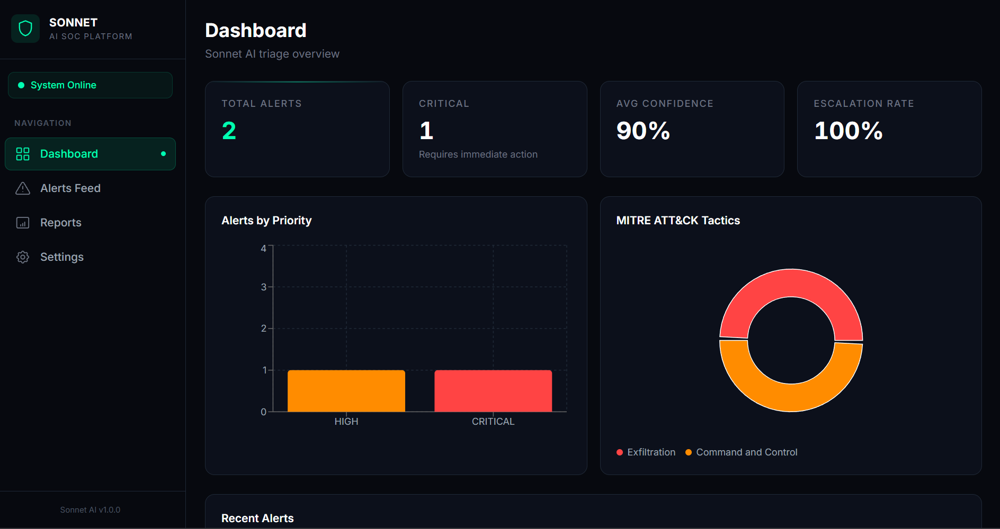
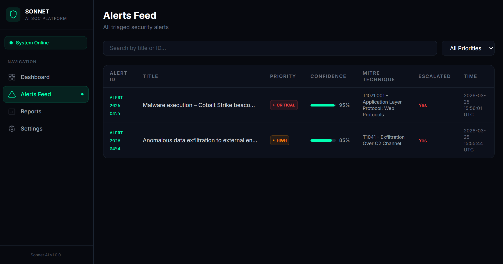
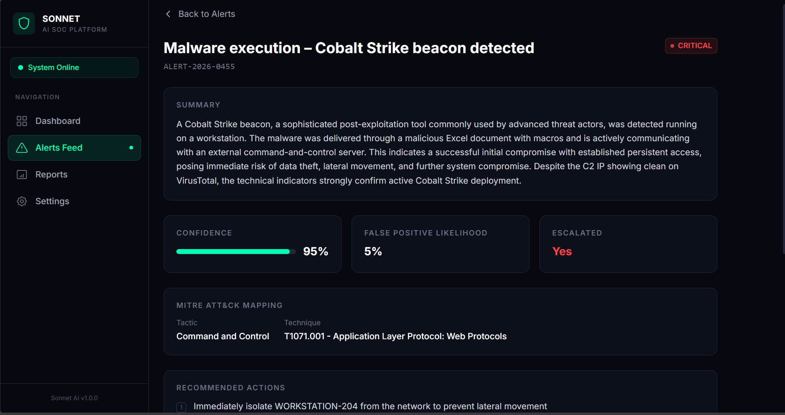
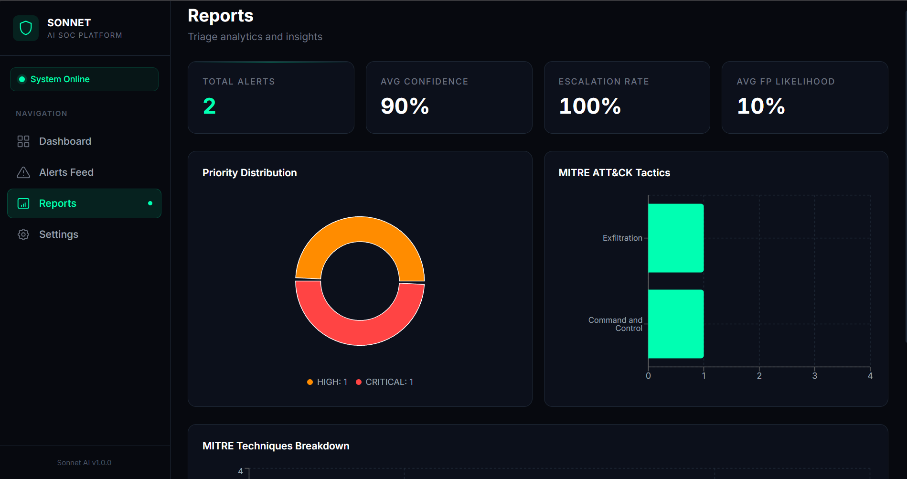
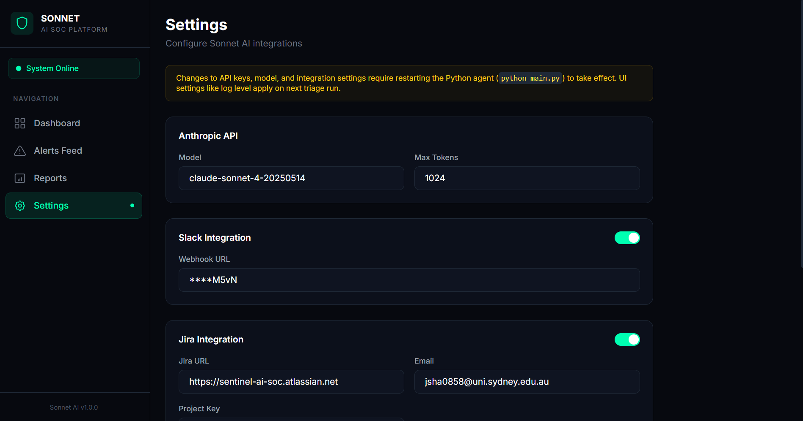

# Sonnet AI

**Automated security alert triage for SOC teams that are drowning in alerts.**

Sonnet AI is an autonomous triage agent that sits between your SIEM and your analysts. It ingests security alerts from Elasticsearch, enriches IOCs against VirusTotal, classifies threats with MITRE ATT&CK mapping, and delivers prioritised verdicts to Slack and Jira — in under 18 seconds per alert, 24/7, with zero analyst fatigue.

Built for MSSPs, in-house SOC teams, and IT security managers who need to scale Tier-1 triage without scaling headcount.

**Alert in. Verdict out. Analyst notified.**

---

## Features

- **AI-Powered Triage** — Classifies severity, assigns confidence scores, recommends response actions, and flags false positives — replacing manual Tier-1 alert review.
- **MITRE ATT&CK Mapping** — Every triaged alert is mapped to the most relevant ATT&CK tactic and technique for standardised threat classification.
- **IOC Enrichment** — Extracts IPs, domains, and file hashes from alerts and queries VirusTotal for reputation data before triage.
- **Live SIEM Integration** — Polls Elasticsearch for new alerts in real time, with a built-in generator that simulates 8 attack types using Elastic Common Schema (ECS) fields.
- **Crown Jewel Asset Escalation** — Configurable list of high-value assets (domain controllers, financial servers). Alerts targeting Crown Jewels are automatically escalated one priority level.
- **JWT Authentication** — Secure login with httpOnly cookie-based sessions. All dashboard routes are protected by edge middleware.
- **Multi-Tenant Support** — MSSP-ready client selector with per-tenant filtered views across all dashboard pages, stats, and reports.
- **Human-in-the-Loop Feedback** — Analysts can confirm or correct triage verdicts. Feedback is tracked per alert and surfaced as accuracy metrics.
- **Executive PDF Reports** — Printable CISO-ready summary with KPIs, priority breakdowns, MITRE tactics, time saved estimates, and feedback accuracy rates.
- **Slack Notifications** — Posts triage verdicts to a Slack channel via webhook so analysts see results the moment they land.
- **Jira Ticket Creation** — Automatically creates Jira issues for escalated CRITICAL/HIGH alerts with full triage context attached.
- **Web Dashboard** — Real-time Next.js dashboard with stat cards, priority charts, MITRE donut breakdowns, alert drill-down, and a settings panel.
- **One-Click Demo** — Docker Compose environment with Elasticsearch + Kibana and launcher scripts that start the full stack in one command.
- **False-Positive Scoring** — Estimates false-positive likelihood so analysts focus on what matters, not what's noisy.

---

## Architecture

```
┌──────────────┐    ┌──────────────┐    ┌───────────────┐
│Elasticsearch │───>│  Sonnet AI   │───>│  Slack / Jira │
│  SIEM Index  │    │  Python Agent│    │  (outputs)    │
└──────────────┘    └──────┬───────┘    └───────────────┘
       ^                   │
┌──────┴───────┐    ┌──────v───────┐
│    Alert     │    │   Claude API │
│  Generator   │    │   (triage)   │
└──────────────┘    └──────┬───────┘
                           │
                    ┌──────v───────┐    ┌───────────────┐
                    │VirusTotal API│    │  Next.js Web  │
                    │ (enrichment) │    │  Dashboard    │
                    └──────────────┘    └───────────────┘
```

---

## Prerequisites

- Python 3.11+
- Node.js 18+ and npm (for the web dashboard)
- Docker and Docker Compose (for the Elasticsearch SIEM demo)
- An [Anthropic API key](https://console.anthropic.com/)
- (Optional) A [VirusTotal API key](https://www.virustotal.com/) for IOC enrichment
- (Optional) A Slack incoming webhook URL
- (Optional) Jira Cloud credentials for ticket creation

---

## Quick Start

### 1. Clone and install

```bash
git clone https://github.com/Jaseelshah/sonnet-ai.git
cd sonnet-ai

# Python setup
python -m venv venv
source venv/bin/activate        # Linux / macOS
venv\Scripts\activate           # Windows
pip install -r requirements.txt

# Web dashboard setup
cd webapp
npm install
cd ..
```

### 2. Configure environment

```bash
cp .env.example .env
# Edit .env with your API keys (see Environment Variables below)
```

Also copy dashboard credentials into the webapp directory:

```bash
# Create webapp/.env.local with DASHBOARD_EMAIL, DASHBOARD_PASSWORD, JWT_SECRET, TENANTS
# (Next.js loads .env.local from its own directory)
```

### 3. Run the Python triage agent

```bash
# Mock mode — triage static sample alerts (default)
python main.py

# Live mode — poll Elasticsearch for real-time alerts
python main.py --source elastic
```

In mock mode, the agent will:

1. Load alerts from `mock_data/alerts.json`
2. Extract and enrich IOCs via VirusTotal (if enabled)
3. Send each alert to Claude for triage
4. Apply Crown Jewel escalation if the alert targets a high-value asset
5. Assign a tenant (if multi-tenancy is configured)
6. Print formatted triage reports to the console
7. Send Slack notifications and create Jira tickets (if enabled)
8. Save results to `logs/triage_results.json`

### 4. Start the web dashboard

```bash
cd webapp
npm run dev
```

Open [http://localhost:3000](http://localhost:3000) and log in with your configured credentials (default: `admin@sonnet-ai.com`).

Or use the convenience scripts:

```bash
./start.sh          # Linux / macOS
start.bat           # Windows
```

### 5. Run the full SIEM demo (Elasticsearch + Kibana)

Launch the complete stack with one command — Elasticsearch, Kibana, alert generator, triage agent, and web dashboard:

```bash
# Windows
start-demo.bat

# Linux / macOS
./start-demo.sh
```

This will:

1. Start Elasticsearch 8.11 and Kibana 8.11 via Docker Compose
2. Wait for Elasticsearch to become healthy
3. Launch the alert generator (produces ECS-compliant security alerts every 30s)
4. Launch the triage agent in live Elasticsearch mode
5. Start the Next.js dashboard at [http://localhost:3000](http://localhost:3000)

Services will be available at:

| Service | URL |
|---------|-----|
| **Dashboard** | [http://localhost:3000](http://localhost:3000) |
| **Kibana** | [http://localhost:5601](http://localhost:5601) |
| **Elasticsearch** | [http://localhost:9200](http://localhost:9200) |

The generator simulates 8 attack types: brute force, lateral movement, privilege escalation, data exfiltration, malware execution, port scanning, suspicious PowerShell, and failed MFA.

---

## Web Dashboard

The dashboard is a Next.js 14 app with JWT authentication and multi-tenant support:

| Page | Route | Description |
|------|-------|-------------|
| **Login** | `/login` | Secure login with email and password |
| **Dashboard** | `/` | Stat cards, priority bar chart, MITRE donut chart, recent alerts, feedback coverage |
| **Alerts Feed** | `/alerts` | Searchable, filterable alert list with review status badges |
| **Alert Detail** | `/alerts/[id]` | Deep-dive view with confidence bars, MITRE mapping, analyst feedback buttons |
| **Reports** | `/reports` | Summary statistics with priority and MITRE technique charts |
| **Executive Report** | `/reports/executive` | Printable CISO-ready PDF with KPIs and time saved estimates |
| **Settings** | `/settings` | Configure model, integrations, and triage thresholds |

### API Routes

| Endpoint | Method | Description |
|----------|--------|-------------|
| `/api/auth/login` | POST | Authenticate and receive JWT token |
| `/api/auth/logout` | POST | Clear authentication cookie |
| `/api/auth/me` | GET | Check current authentication status |
| `/api/stats` | GET | Dashboard statistics with `?tenant=` filter |
| `/api/alerts` | GET | Alerts list with `?search=`, `?priority=`, `?tenant=` filters |
| `/api/alerts/[id]` | GET | Single alert with full triage details |
| `/api/alerts/[id]/feedback` | GET/POST | Read or submit analyst feedback for an alert |
| `/api/feedback` | GET | All feedback entries as a map |
| `/api/tenants` | GET | List of configured tenant names |
| `/api/reports/executive` | GET | Executive summary data with `?tenant=` filter |
| `/api/settings` | GET/POST | Read or update configuration |

---

## Environment Variables

Create a `.env` file in the project root (see `.env.example`):

| Variable | Required | Default | Description |
|----------|----------|---------|-------------|
| `ANTHROPIC_API_KEY` | **Yes** | — | Anthropic API key |
| `ANTHROPIC_MODEL` | No | `claude-sonnet-4-20250514` | Claude model to use |
| `ANTHROPIC_MAX_TOKENS` | No | `1024` | Max response tokens |
| `VIRUSTOTAL_ENABLED` | No | `false` | Enable IOC enrichment |
| `VIRUSTOTAL_API_KEY` | If VT enabled | — | VirusTotal API key |
| `SLACK_ENABLED` | No | `false` | Enable Slack notifications |
| `SLACK_WEBHOOK_URL` | If Slack enabled | — | Slack incoming webhook URL |
| `JIRA_ENABLED` | No | `false` | Enable Jira integration |
| `JIRA_URL` | If Jira enabled | — | Jira Cloud instance URL |
| `JIRA_EMAIL` | If Jira enabled | — | Jira account email |
| `JIRA_API_TOKEN` | If Jira enabled | — | Jira API token |
| `JIRA_PROJECT_KEY` | If Jira enabled | — | Jira project key |
| `CROWN_JEWELS` | No | — | Comma-separated high-value hostnames (e.g. `DC01,FINANCE-SRV`) |
| `DASHBOARD_EMAIL` | No | — | Dashboard login email |
| `DASHBOARD_PASSWORD` | No | — | Dashboard login password |
| `JWT_SECRET` | No | — | Secret key for signing JWT tokens |
| `TENANTS` | No | — | Comma-separated tenant names (e.g. `Acme Corp,TechStart`) |
| `ELASTIC_URL` | No | `http://localhost:9200` | Elasticsearch base URL |
| `ELASTIC_USERNAME` | No | — | Elasticsearch username (if auth enabled) |
| `ELASTIC_PASSWORD` | No | — | Elasticsearch password (if auth enabled) |
| `ELASTIC_INDEX` | No | `sonnet-ai-alerts` | Elasticsearch index for SIEM alerts |
| `ELASTIC_VERIFY_SSL` | No | `false` | Verify TLS certificates for Elasticsearch |
| `FALSE_POSITIVE_THRESHOLD` | No | `0.7` | Threshold for false-positive scoring |
| `LOG_LEVEL` | No | `INFO` | Logging level (`DEBUG`, `INFO`, `WARNING`, `ERROR`) |

---

## Running Tests

```bash
# Run all tests
python -m pytest tests/ -v

# Run with coverage
python -m pytest tests/ --cov=. --cov-report=term-missing
```

---

## MCP Server

Sonnet AI can be used as an MCP server, allowing Claude Code, Claude Desktop, or any MCP-compatible client to access triage capabilities directly.

### Quick Setup (Claude Code)

Add to your MCP configuration:

```json
{
  "mcpServers": {
    "sonnet-ai": {
      "command": "python",
      "args": ["-m", "mcp_server.server"],
      "cwd": "/path/to/sentinel-ai"
    }
  }
}
```

### Available Tools

| Tool | Description |
|------|-------------|
| `triage_alert` | Triage a security alert with AI and MITRE ATT&CK mapping |
| `enrich_ioc` | Look up IOC reputation in VirusTotal |
| `get_recent_alerts` | Get the most recently triaged alerts |
| `get_stats` | Dashboard statistics and priority breakdown |
| `get_alert_by_id` | Look up a specific alert by ID |

See [mcp_server/README.md](mcp_server/README.md) for full documentation.

---

## Project Structure

```
sonnet-ai/
├── main.py                      # Entry point — orchestrates the triage pipeline
├── docker-compose.yml           # Elasticsearch 8.11 + Kibana 8.11
├── requirements.txt             # Python dependencies
├── .env.example                 # Environment variable template
├── start.sh / start.bat         # Convenience scripts to launch the webapp
├── start-demo.sh / start-demo.bat  # Full SIEM demo launchers
│
├── agent/
│   ├── triage_agent.py          # Core agent — calls Claude API, parses response
│   └── prompt.py                # System and user prompts for the triage LLM
│
├── models/
│   ├── alert.py                 # Normalised security alert dataclass
│   └── triage.py                # Triage result with priority, MITRE mapping, tenant
│
├── parsers/
│   └── elastic.py               # Elasticsearch poller — ECS-to-Alert conversion
│
├── simulators/
│   └── elastic_generator.py     # Generates realistic ECS alerts into Elasticsearch
│
├── enrichment/
│   └── virustotal.py            # IOC extraction and VirusTotal v3 lookups
│
├── outputs/
│   ├── slack.py                 # Slack webhook integration
│   └── jira.py                  # Jira REST API v3 ticket creation
│
├── config/
│   └── settings.py              # Environment variable loading and validation
│
├── mcp_server/
│   ├── __init__.py              # Package marker
│   ├── __main__.py              # Entry point for python -m mcp_server
│   ├── server.py                # MCP server with 5 tools
│   └── README.md                # MCP setup documentation
│
├── scripts/
│   ├── env_utils.py             # Shared .env file parser
│   └── wait-for-elastic.py      # Waits for Elasticsearch readiness
│
├── mock_data/
│   └── alerts.json              # Sample security alerts for testing
│
├── tests/
│   ├── test_alert.py            # Alert model tests
│   ├── test_triage.py           # Triage result tests
│   ├── test_triage_agent.py     # Agent tests (mocked API)
│   ├── test_slack.py            # Slack integration tests
│   └── test_virustotal.py       # IOC extraction and enrichment tests
│
├── logs/                        # Runtime outputs (gitignored)
│   ├── sentinel.log
│   ├── triage_results.json
│   └── feedback.json
│
└── webapp/                      # Next.js 14 web dashboard
    ├── package.json
    ├── middleware.ts             # JWT auth guard for all routes
    ├── app/
    │   ├── layout.tsx           # Root layout with auth-aware shell
    │   ├── page.tsx             # Dashboard — stats, charts, feedback coverage
    │   ├── globals.css          # Global styles + print CSS
    │   ├── login/page.tsx       # Secure login page
    │   ├── alerts/
    │   │   ├── page.tsx         # Searchable alerts feed with review badges
    │   │   └── [id]/page.tsx    # Alert detail + analyst feedback buttons
    │   ├── reports/
    │   │   ├── page.tsx         # Reports with summary charts
    │   │   └── executive/page.tsx  # Printable CISO executive summary
    │   ├── settings/page.tsx    # Configuration panel
    │   └── api/
    │       ├── auth/
    │       │   ├── login/route.ts   # POST /api/auth/login
    │       │   ├── logout/route.ts  # POST /api/auth/logout
    │       │   └── me/route.ts      # GET /api/auth/me
    │       ├── stats/route.ts       # GET /api/stats (tenant-aware)
    │       ├── alerts/
    │       │   ├── route.ts         # GET /api/alerts (with filters)
    │       │   └── [id]/
    │       │       ├── route.ts     # GET /api/alerts/[id]
    │       │       └── feedback/route.ts  # GET/POST analyst feedback
    │       ├── feedback/route.ts    # GET /api/feedback (all entries)
    │       ├── tenants/route.ts     # GET /api/tenants
    │       ├── reports/
    │       │   └── executive/route.ts  # GET /api/reports/executive
    │       └── settings/route.ts    # GET/POST /api/settings
    ├── components/
    │   ├── AppShell.tsx         # Main layout with sidebar
    │   ├── AuthShell.tsx        # Auth-aware layout wrapper
    │   ├── Sidebar.tsx          # Left navigation with tenant selector
    │   ├── TenantSelector.tsx   # Multi-tenant client dropdown
    │   ├── AlertsTable.tsx      # Reusable alerts table with review column
    │   ├── FeedbackBadge.tsx    # Confirmed/Corrected/Pending badge
    │   ├── PriorityBadge.tsx    # Colour-coded priority pill
    │   └── StatCard.tsx         # Dashboard stat card
    └── lib/
        ├── auth.ts              # JWT token creation and verification
        ├── data.ts              # File I/O with caching
        ├── types.ts             # TypeScript interfaces
        └── utils.ts             # Utility functions
```

---

## Screenshots

### Dashboard


### Alerts Feed


### Alert Detail — Cobalt Strike Beacon


### Reports


### Settings


---

## Tech Stack

| Layer | Technology |
|-------|-----------|
| AI Engine | [Claude API](https://docs.anthropic.com/) (Anthropic) |
| Backend Agent | Python 3.11+, Anthropic SDK |
| SIEM | Elasticsearch 8.11, Kibana 8.11 (Docker) |
| IOC Enrichment | VirusTotal API v3 |
| Web Dashboard | Next.js 14, React 18, TypeScript, Tailwind CSS |
| Authentication | JWT (jose), httpOnly cookies, edge middleware |
| Charts | Recharts |
| Notifications | Slack Webhooks |
| Ticketing | Jira REST API v3 |

---

## Author

**Jaseel Shah** — [github.com/Jaseelshah](https://github.com/Jaseelshah)

---

## License

This project is for educational and authorised security operations use only.
